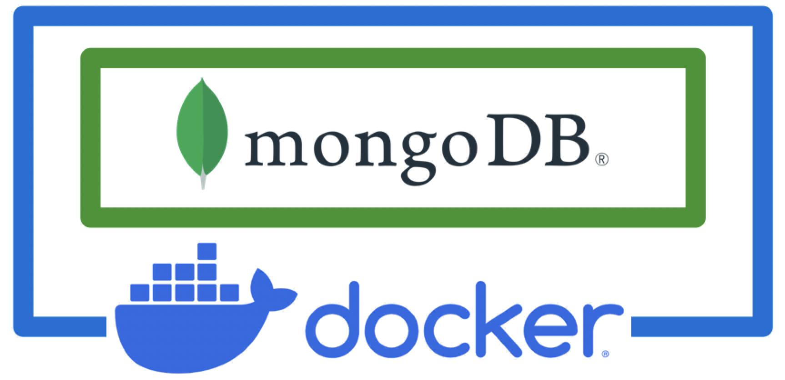

# Database Systems (CS305) Lab 7 Assignment

Queries in MongoDB

**Assigned** : Thursday 16 November 2023

**Due** : Tuesday 21 November 2023



Figure 1: MongoDB is characterized as a *No-SQL* technology. This means that the technology does not use the relational tables that would be used by traditional SQL systems. A No-SQL system also implies that there is no schema necessary to be built by a database architect. Instead, MongoDB uses *collections* to contain all *documents* of data. MongoDB handles queries and other CRUD tasks (i.e., Create, Read, Update and Delete) by parsing and other functionalities that handle text.

In this lab, you will use Docker to create a functional local MongoDB. In class, we will cover the creation of the Docker container which houses the database. Once this system is working, you will run queries on synthetic data to experiment with this fascinating new database technology.

## Project Goals

* To learn how to install Docker.
* To learn how to use Docker to create a container that houses a functional Mongo database.
* To gain experience working with both Docker commands and MongoDB to accomplish common tasks to maintain.
* To gain experience with command syntaxes for working with MongoDB queries.

## Instructions

The data was downloaded from [https://json-generator.com/](https://json-generator.com/) and is completely fictitious -- none of the information relates to real people or companies. The data has been saved in `json` formatting and is available in `data/dataset.json`. Your task is to use this data to create a local MongoDB database. You will then use your database to respond to the query challenges found in the File `src/queries.md`.

Note: To populate your MongoDB, you can conveniently copy and paste the contents of the `json` file into the MongoDB client.

---

## Deliverables

Summary of the Required Deliverables. Please submit your work by pushing it to your GitHub Classroom repository.

**Database-queries file**: You will submit your queries and responses in the File; (`src/queries.txt`).

### Screenshots

If you would like to add screenshots to your work, please use the the following Markdown code;

``` markdown

```

The following html code serves to scale-down your graphic.

``` markdown

```

If you are using VSCode, then you can visualize your completed Markdown file to determine whether your files are present and are displaying in your document.

## Technical Information

### Git

Practicing software developers normally use a version control system to manage most of the artifacts produced during the phases of the software development life cycle.

In this course, we will always use the `git` distributed version control system to manage the files associated with our course. In particular, we will use this secure resource to submit all our assignments and projects.

To help you get started with installing course software, our course [resources page](https://www.oliverbonhamcarter.com/resources/), contains URL links to download sites and important tutorials.

Note, if you are using a Mac or Linux machine, you may already have this software installed; try typing `git` at your terminal to check. On a MacOS machine, this command will ask you whether you wish to install `xCode`. Please follow the steps to install.

If you are using a Windows machine then it is likely that you will need to install the software. Ask a Technical Leader or your instructor for help as necessary.

### Create your account on GitHub

It is assumed that you already have an account on GitHub but if you do not, then please visit [github.com](http://www.github.com) to create your account using your Allegheny email address. Follow the account generation links to create an account on GitHub using a normal name (to identify you) and be sure to add a current photo of yourself when completing your profile.

### Add Your SSH Keys to your account

SSH keys allow you to interact with GitHub using secure means. Using these keys, you can conveniently push and pull data from GitHub without having to input your user name and password each time. When developing code, it will be desirable to make frequent pushes to GitHub with your code so that any problems or bugs can be isolated with the development of specific parts of code.

To learn more about creating and adding your ssh keys to your GitHub account. Please visit https://www.ssh.com/ssh/keygen/ to learn how to set-up your security keys. Let the instructor know if you have any questions with this task. For more information about ssh keys, please watch Professor Luman’s SSH Key [video](https://www.youtube.com/watch?v=qEPjUGQFmzQ&list=PLsYZRXov75ZHSwWiCk0-jd1RcTuu_-zmD).

### Submitting Assignments

As you are working on your lab, you are to commit and push regularly. The commands are the following.

``` bash
git add -A
git commit -m ‘‘Your notes about commit here’’
git push
```

## Project Assessment

The grade that a student receives on this assignment will have the following components.

* **GitHub Actions CI Build Status [up to 15%]:**: For the lab repository associated with this assignment students will receive a checkmark grade if their last before-the-deadline build passes. This is only checking some baseline writing and commit requirements as well as correct running of the program. An additional reduction will be given if the commit log shows a cluster of commits at the end clearly used just to pass this requirement. An additional reduction will also be given if there is no commit during lab work times. All other requirements are evaluated manually.

* **Mastery of Technical Knowledge and Skills [up to 85%]**: Students will receive a portion of their assignment grade when their program implementation reveals that they have mastered all of the technical knowledge and skills developed during the completion of this assignment. As a part of this grade, the instructor will assess aspects of the programming including, but not limited to, the completeness and the correctness of the program and the use of effective source code comments.

## GatorGrade

### Checks for GatorGrade

For immediate feedback on submissions, we will be using Gator Grade to inform the of missing components in the submission. As you submit, you will notice that there is a thick red X that will change to a green check mark when all components have been included in the submission. You are encouraged to click on the red X to find a listing of the components to address.

You can check the baseline writing and commit requirements for this lab assignment by running the department's assignment checking `gatorgrade` tool. To use `gatorgrade`, you first need to make sure you have Python installed (type `python --version` to check). If you do not have Python installed, please see:

* [Setting Up Python on Windows](https://realpython.com/lessons/python-windows-setup/)
* [Python 3 Installation and Setup Guide](https://realpython.com/installing-python/)
* [How to Install Python 3 and Set Up a Local Programming Environment on Windows 10](https://www.digitalocean.com/community/tutorials/how-to-install-python-3-and-set-up-a-local-programming-environment-on-windows-10)

Then, if you have not done so already, you need to install `gatorgrade`:

- First, [install `pipx`](https://pypa.github.io/pipx/installation/)
- Then, install `gatorgrade` with `pipx install gatorgrade`

Finally, you can run `gatorgrade`:

`gatorgrade --config config/gatorgrade.yml`

## Seeking Assistance

Extra resources for using markdown include;

* [Markdown Tidbits](https://www.youtube.com/watch?v=cdJEUAy5IyA)

* [Markdown Cheatsheet](https://github.com/adam-p/markdown-here/wiki/Markdown-Cheatsheet)

Do not forget to use the above git commands to push your work to the cloud for the instructor to grade your assignment. You can go to your GitHub repository using your browser to verify that your files have been submitted. Please see the TL’s or the instructor if you have any questions about assignment submission.

Students who have questions about this project outside of the lab time are invited to ask them in the course's Discord channel or during instructor's or TL's office hours.
